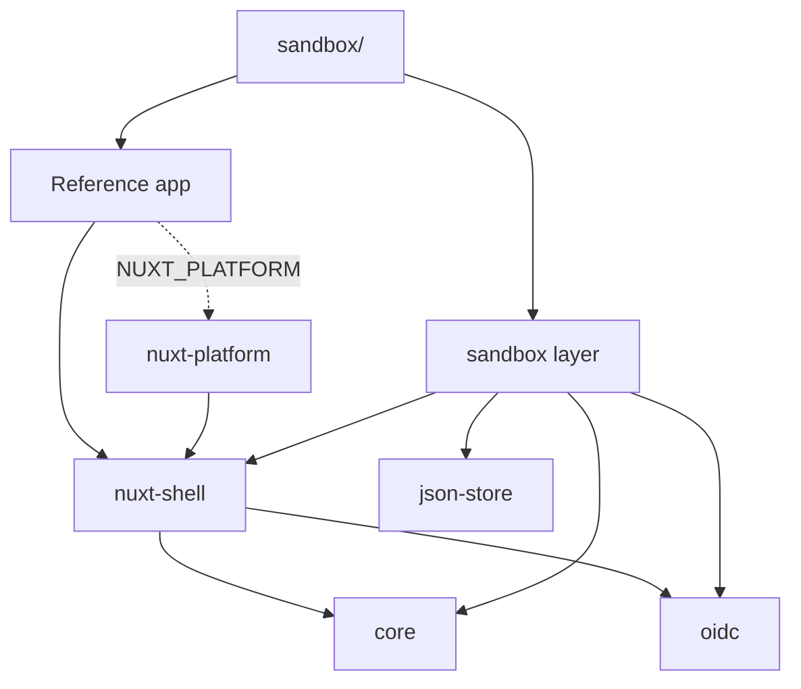

# Architecture

This repository is a foundation for SaaS apps that share the same core: users,
organizations, workspaces, sign-in, and a platform admin area. It holds the
shared packages, and a reference app that shows how an app is built on them.
Each app is its own product, with its own users and its own database. Apps share
code, not data.

## The Guiding Rule

If something is the same in every app, and a bug fix to it should reach every
app at once, it goes in `packages/`. Anything that differs per app stays in the
app. New apps aren't forks of this repository: they install the packages, and
receive improvements as version bumps.

## Packages

| Package                   | Kind       | What it holds                                                                                                                                 |
| ------------------------- | ---------- | --------------------------------------------------------------------------------------------------------------------------------------------- |
| `@kmjbyrne/core`          | TypeScript | The domain: entities, values, ports, services and rules. No storage, HTTP or Nuxt code.                                                       |
| `@kmjbyrne/oidc`          | TypeScript | OpenID Connect sign-in with PKCE, for any provider                                                                                            |
| `@kmjbyrne/json-store`    | TypeScript | Collections of JSON documents, in memory or in a file, for development and tests                                                              |
| `@kmjbyrne/nuxt-shell`    | Nuxt layer | What every app runs in: sign-in, sessions, the service container, the MariaDB adapter, and the org and workspace routes, pages and components |
| `@kmjbyrne/nuxt-platform` | Nuxt layer | The platform admin area at `/platform`, built in only when `NUXT_PLATFORM=true`                                                               |
| `@kmjbyrne/sandbox`       | Nuxt layer | Local development only: dev data in a JSON file, a stand-in for the sign-in provider, and dev tools                                           |

The repository root is the reference app, which ships to production. `sandbox/`
is its dev wrapper: a Nuxt app that extends the reference app and the sandbox
layer. `pnpm dev` runs it, and it is never built for production.

Dependencies point one way:



`core`, `oidc` and `json-store` depend on none of the other packages, and on
nothing from Nuxt. Nothing in production depends on the sandbox layer or on
`json-store`. ESLint enforces these rules, and that every package is used
through its public entry points. `pnpm check:bundle` builds the app as
production does and fails if sandbox code, or platform code when it's switched
off, reached the build.

## Hexagonal Layout

Core is the inside. It reaches the outside world only through ports, which are
interfaces it defines: `Repositories` (users, orgs, workspaces, org memberships
and workspace memberships, plus transactions), `IdGenerator`, `CurrentUser` and
`SignInProvider`. Adapters implement the ports:

| Port             | Production adapter                          | Development and test adapters                                                          |
| ---------------- | ------------------------------------------- | -------------------------------------------------------------------------------------- |
| `Repositories`   | `MysqlRepositories` in `nuxt-shell`         | `JsonStoreRepositories` in the sandbox, `InMemoryRepositories` in core's testing entry |
| `SignInProvider` | `OidcSignInProvider` on a real `OidcClient` | `OidcSignInProvider` on the sandbox's `FakeOidcClient`                                 |
| `IdGenerator`    | `UuidIdGenerator`                           | `SequentialIdGenerator`                                                                |
| `CurrentUser`    | `SessionCurrentUser`                        | `FakeCurrentUser`                                                                      |

The shell's container (`server/utils/container.ts`) is the one place services
get their adapters, by plain constructor injection. It builds the production
adapters by default, and the sandbox replaces them with `provideAdapters` from a
Nitro plugin. Every implementation of `Repositories` passes the same contract
suite, `repositoryContract`, so they behave the same.

## Standards

These hold in every app, and aren't configurable.

- **Tenancy is path-based:** `/[org]/[workspace]/...`, by slug, such as
  `/acme/general`. The URL is the only source of truth for which org and
  workspace a request acts on. The session remembers the last-used workspace,
  but only to decide where `/` goes.
- **Slugs** have 3 to 32 lowercase letters, numbers and single hyphens, and
  don't start or end with a hyphen. One is suggested from the name, and can be
  edited. Org slugs can't be the names of the app's fixed routes, such as
  `login` or `platform`. A changed org slug keeps redirecting, and is never
  given to another org.
- **Sign-in is OpenID Connect only,** with Google for now. There are no
  passwords. The provider is configuration: Google needs only a client id and
  secret, and another provider needs its issuer too.
- **Registration is closed.** Only people a platform admin set up can sign in.
- **App data extends the foundation by composition.** An app's own entities
  refer to `UserId`, `OrgId` and `WorkspaceId`, and never extend the
  foundation's entities.

## Orgs, Workspaces and Roles

The org is the top-level tenant, and contains workspaces. Every user has a
personal org, created with them, of which they are the only member. A company
org has many members, and only platform admins create one.

Three kinds of role decide who may do what, and they stay separate everywhere:

- The **platform role** is granted to a few users, and covers the whole
  platform. A platform admin creates company orgs and users, assigns org members
  and roles, and deactivates users. Being one doesn't make them a member of any
  org. Grants live in their own table, recording who granted each and when.
- The **org role** belongs to an org membership: `owner`, `admin` or `member`.
  Owners and admins create workspaces, and act as owners of every workspace in
  their org.
- The **workspace role** belongs to a workspace membership: `owner`, `editor` or
  `viewer`. Plain org members, and people from outside the org, see a workspace
  only through a workspace membership. That is how a workspace is shared: its
  owner invites someone by email, and the invitation becomes a membership when
  they next open the app. Inviting answers the same for every email, so it never
  reveals who has an account.

An org always keeps an owner, and a workspace always keeps an owner member.
Anything a user can't see is "not found", so its existence isn't revealed. A
deactivated user can't sign in, and their sessions stop working everywhere, but
nothing of theirs is removed.

## Sign-In

1. `GET /api/auth/login` makes a `state`, `nonce` and PKCE verifier, keeps them
   in a short-lived sealed cookie, and redirects to the provider.
2. `GET /api/auth/callback` checks the returned `state` against the cookie and
   ends the round trip, so it can't be replayed. It completes the sign-in with
   the provider, then asks core who the person is.
3. Core signs in a user who already has this provider account. Otherwise it
   links the account to the user a platform admin set up with that email, if the
   provider has verified the email. Anyone else is refused as not invited, and
   nothing is created. Unverified emails, deactivated users, and an email linked
   to a different account at the same provider are refused too.
4. The session starts, and `/` takes the user to their last-used workspace,
   their only org's first workspace, or `/choose`.

The ID token's signature isn't checked: it comes straight from the provider's
token endpoint over TLS, in exchange for the client secret, which OpenID Connect
Core 1.0 allows in place of a signature check. Its claims are checked.

## Adding a Feature to an App

An app adds its own domain on top of the foundation in the same layers. Take a
hypothetical invoices feature:

1. **Entity:** `core/entities/Invoice.ts`, referring to `WorkspaceId` and
   `UserId`. The app's `core/` has no Nuxt, HTTP, Zod or storage imports.
2. **Port:** `core/ports/InvoiceRepository.ts`.
3. **Permissions:** `core/permissions.ts` extends `workspacePermissions` with
   the feature's own, such as `'invoices.approve': 'owner'`. Code asks for
   permissions, never roles.
4. **Service:** `core/services/InvoiceService.ts`. Every method starts with
   `workspaceAccess.require` with a permission, such as `'invoices.approve'`,
   and `invoicePermissions`, so every app checks access the same way. Its tests
   use `createTestServices()` from `@kmjbyrne/core/testing`.
5. **Repositories:** one on the JSON store in `sandbox/server/`, with fixtures,
   and one on MariaDB in the app's `server/`, using `useDatabase()`. Both pass
   the same contract tests.
6. **Contract:** `shared/contracts/invoices.ts`, as Zod schemas.
7. **Routes:** under `server/api/orgs/[org]/workspaces/[workspace]/invoices/`,
   each validating its input with the contract, calling one service method, and
   mapping the result to the contract.
8. **Registration:** a Nitro plugin in `server/plugins/` calls
   `registerServices`, typed by extending `AppServices` and `AppAdapters`. The
   sandbox's plugin supplies the JSON repository with `provideAdapters`.
9. **Page:** under `app/pages/[org]/[workspace]/`, linked from the layout.

## Databases

Production runs on MariaDB or MySQL through Drizzle. The shell's schema covers
its tables. An app's `drizzle.config.ts` lists that schema next to its own, and
the app owns one migration history for both: after upgrading the shell, it
generates a migration for any change to the shell's tables.

The first platform admin of a fresh install is created from the command line,
since registration is closed and nobody can sign in yet:

```bash
pnpm db:migrate
pnpm platform:grant you@example.com "Your Name"
```

## Staying Current

The packages are published to npm with restricted access under `@kmjbyrne`, and
versioned together, with one changelog at the root of this repository. Each app
pins them, and a dependency bot such as Renovate opens a pull request when a new
version is out. Changes to shared behaviour are made here, never in an app's
copy of a package.

## Growing Into a Control Plane

If the same customers start using several apps, the foundation can grow into a
shared control plane without changing core. A central identity provider, such as
Auth0, replaces Google through configuration. Accounts, provisioning and
entitlements move into the control plane, and each app's users, orgs and
memberships become local copies, kept current by a provisioning adapter that
writes through the same repositories. Personal orgs, workspaces and sharing stay
in each app. The platform area then shrinks to product-specific support tools.
Nothing in this build depends on any of it.
